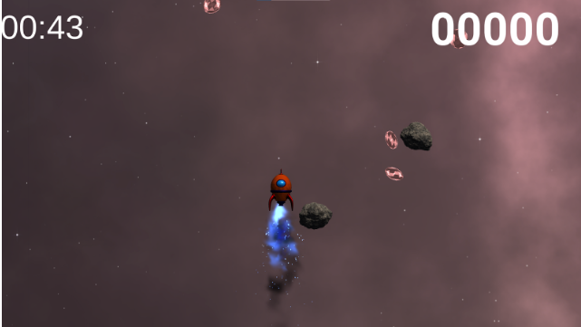

# Portfolio

- 荒川　龍
- 連絡先 Twitter [@double_dg] / Email [ryuryu3221@gmail.com](mailto:ryuryu3221@gmail.com)
- 専門学校デジタルアーツ東京 ゲームプログラムコース 2024年卒業予定

## 資格
-

## スキル
- 

## 取り組んでいるテーマ
1. オリジナルゲーム開発
1. オブジェクト指向のポリモーフィズムの活用事例の制作
  
4. 基本情報処理に関連する数学やアルゴリズムの仕組みを試せるアプリの開発

## 作品リスト

### SPACE RUN

ロケットを操作して宇宙空間をどこまでいけるか飛び続けるゲーム

## 連絡先
- ブログ [tanaka's Programming Memo](https://am1tanaka.hatenablog.com/)
- Twitter [@am1tanaka](https://twitter.com/am1tanaka)
- E-mail [a@a.a](mailto:a@a.a)